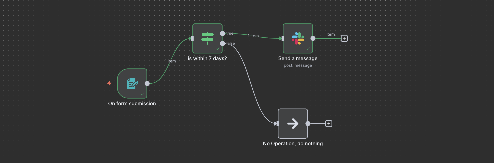

# N8N Slack Notification Workflow

A streamlined workflow to automate Slack notifications based on form submissions with time-based conditions.



## Overview
This workflow processes form submissions and sends notifications to Slack based on specific timing conditions. It's designed to maintain efficient communication while respecting time boundaries.

## Workflow Components

### 1. Form Trigger (Webhook Node)
- Entry point of the workflow
- Listens for form submissions
- Captures form submission data

### 2. IF Node (Time-based Conditional Logic)
- Evaluates submission timestamp against a 7-day window
- Key conditions:
  - Checks if the submission is within 7 days of the current date
  - **Cutoff Logic**: If submission date > (current date - 7 days), proceed with notification
  - Ensures only recent submissions (within last 7 days) trigger notifications
  - Automatically filters out older submissions

### 3. Slack Notification Node
- **If condition is met:**
  - Sends formatted message to specified Slack channel
  - Can include form data in the message
  - Supports custom formatting and mentions
- **If condition is not met:**
  - No action taken
  - Optionally can log late submissions

## Flow Diagram
```
Form Submission → IF (7-day Check) → Slack Message
                        ↓
                   (If False)
                        ↓
                      End
```

## Benefits
- Prevents notification spam from old submissions
- Maintains clean and relevant communication
- Automated time-based filtering
- Customizable message formatting

This workflow ensures that Slack notifications are only sent for recent submissions within the 7-day window, keeping your notifications relevant and timely. All conditions and message formats can be customized based on specific requirements.