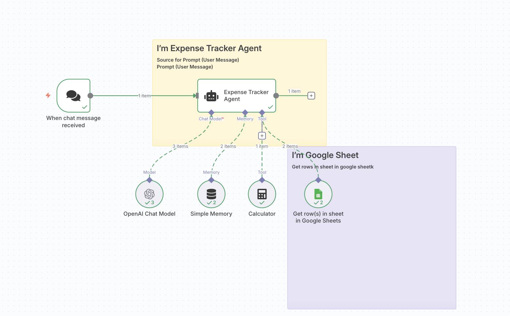

# Expense Tracker Agent (n8n)

This folder contains the n8n workflow for an Expense Tracker Agent that reads from Google Sheets and provides responses via an agentic flow.

## Files

- **Expense Tracker Agent.json**: n8n workflow export
- **image.png**: workflow diagram/screenshot

## Screenshot

## Setup

1. Import `Expense Tracker Agent.json` into your n8n instance
2. Configure Google Sheets credentials
3. Update spreadsheet ID and sheet name in Google Sheets nodes
4. Execute and test with example prompts
